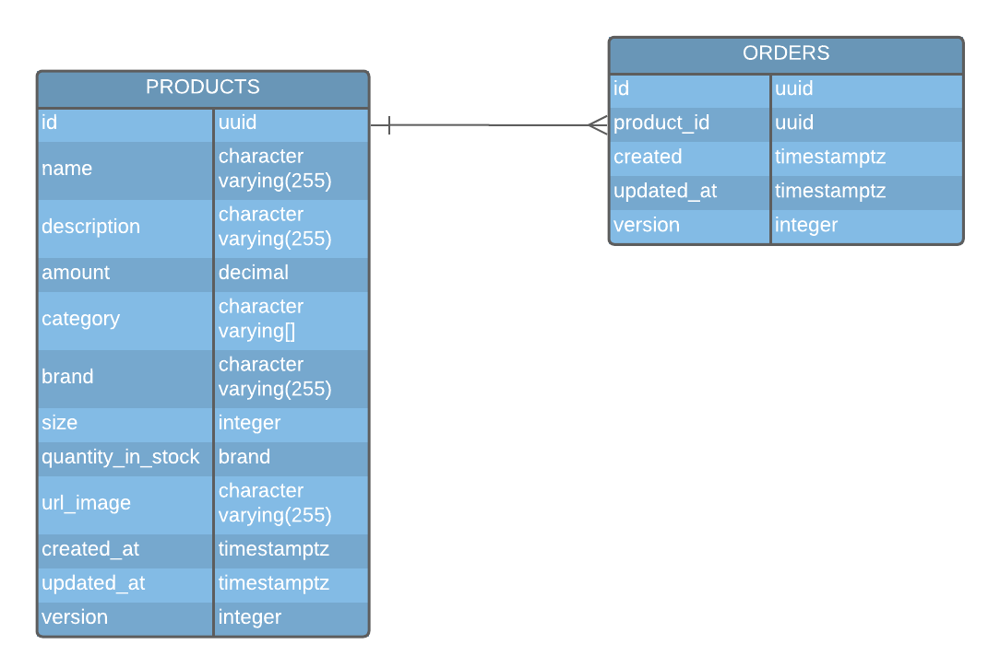
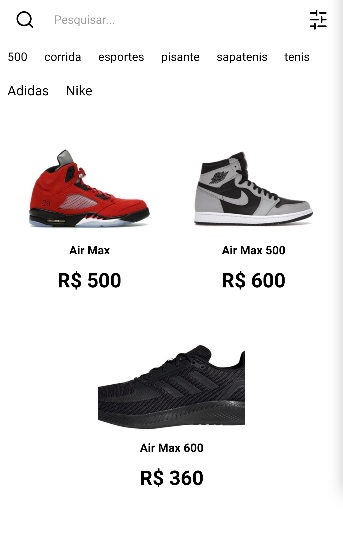
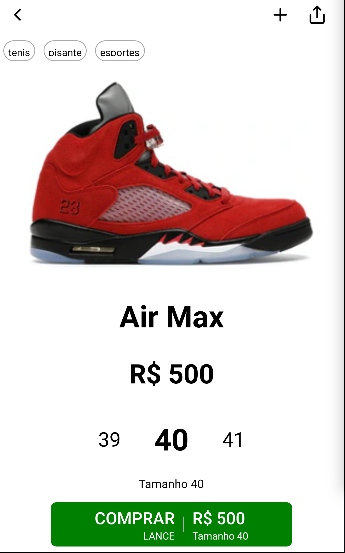
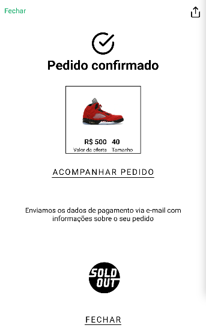

# sell-tenis-mobile

## Endpoints API 📡
`http://localhost:4000`

## How to run 🚀

- Basta construir as imagens com o docker-compose

```sh
  docker-compose -f docker-compose.dev.yml up -d --build
```

ou manualmente:

```sh
  yarn start:dev
```

- Para executar os testes

```sh
  yarn test
```

## Database schema 💾



## Requirements 🔗

<details>
  <summary>Backend</summary>
  
  | N° | FR (functional requirements) | NFR (non-functional requirements) | OK |
  |----|------------------------------|-----------------------------------|----------------|
  | 1  |  Desenvolver a tela de Splash | | ✅ |
  | 2  | Desenvolver a tela de Home | listando os ténis do backend e respeitando os filtros | ✅ |
  | 3  | Desenvolver a tela de Details | | ✅ |
  | 4  | Desenvolver a tela de Success | | ✅ |
</details>

<details>
  <summary>Mobile</summary>
  
  | N° | FR (functional requirements) | NFR (non-functional requirements) | OK |
  |----|------------------------------|-----------------------------------|----------------|
  | 5  | Deve ser possível cadastrar uma nova cidade ao informar corretamente os dados pedidos | | ✅ |
  | 6  | Listagem de tênis (pedidos) | Adicionar filtros | ✅ |
  | 7  | Comprar tênis (criar pedido) | | ✅ |
  | 8  | Criar apenas das tabelas (Product e Order) | | ✅ |
</details>


## Screenshots 📸

> Link do protótipo no [Adobe XD](https://xd.adobe.com/view/805c6555-3e18-4105-98e5-d5486211e920-d50f/)




